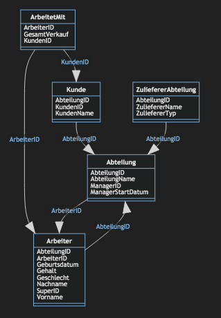

# Beispiel Datenbank einer Firma  
Datenbank visualisiert in "Microsoft Azure Data Studio" genutztes Plugin: 
- *schema-visualization-0.7.1.vsix*

# Feature

# Feel Free
Du kannst gerne mein letztes Realease als .zip Datei downloaden und ausprobieren!

# Review
Wenn du Fragen hast oder mir etwas mitteilen möchtest kannst Du das gerne tun! :blush:
